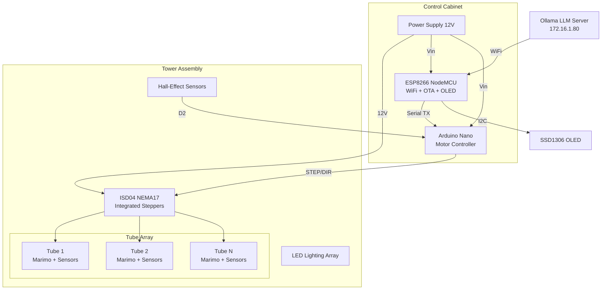
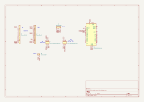
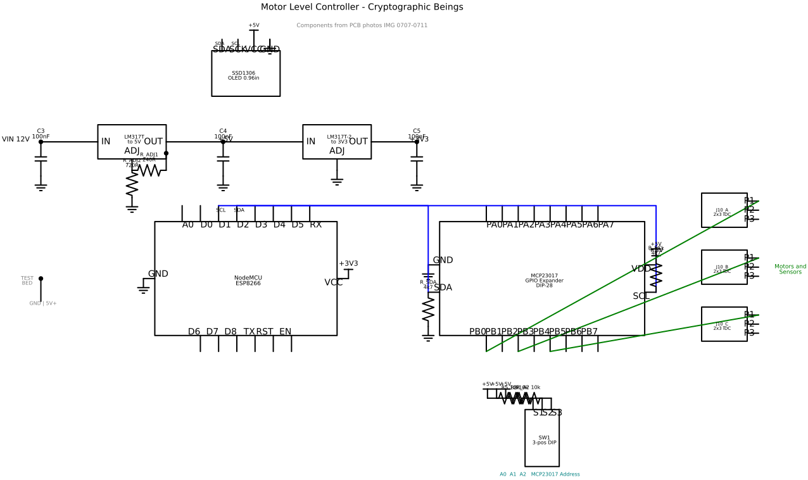
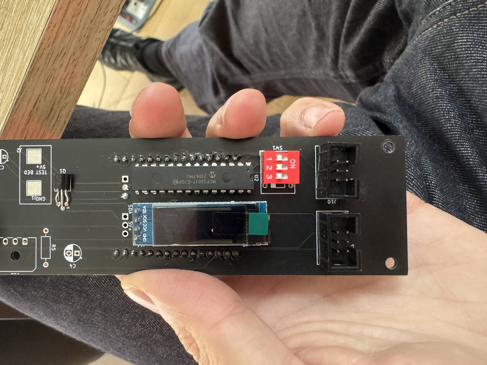
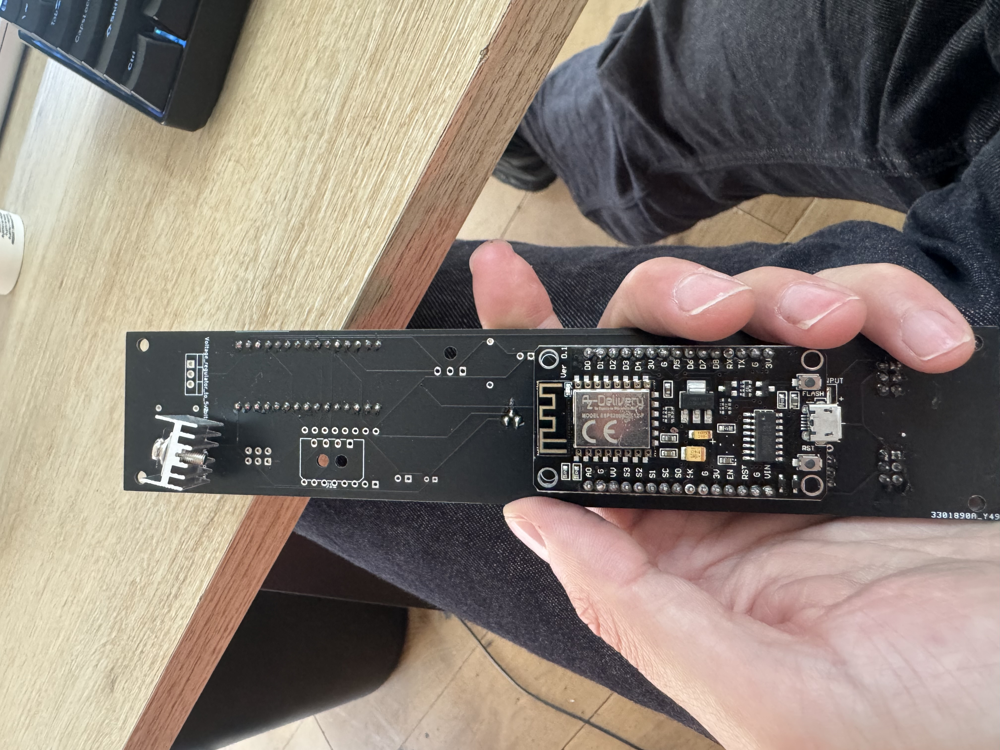

# Cryptographic Beings — Hardware Documentation

## System Architecture

## Schematics

### KiCad Schematic (actual board connectivity)

### Schemdraw Schematic (component overview)

## Motor Level Controller PCB

| Component | Part | Ref | Purpose |
|-----------|------|-----|---------|
| ESP8266 NodeMCU | ESP-12E module on headers | J1/J2 | WiFi brain, OLED, serial bridge |
| Arduino Nano | ATmega328P | A1 | Motor control, sensor reading |
| OLED Display | SSD1306 0.96" I2C | J3 | Status display |
| Motor IDC | 2x3 shrouded connector | J4 | STEP/DIR/12V to ISD04 stepper |
| Sensor IDC | 2x3 shrouded connector | J5 | Hall-effect sensor breakout |
| Power Input | 2-pin connector | J6 | 12V DC power |

### PCB Photos

| Photo | Description |
|-------|-------------|
|  | Full board front |
|  | Board back with NodeMCU |

## Wiring

| Net | From | To | Purpose |
|-----|------|----|---------|
| `tx` | ESP TX (J2.13) | Nano RX (D0) | Serial commands |
| `D4` | Nano D4 | J4 IDC → ISD04 PUL+ | Step pulse |
| `D5` | Nano D5 | J4 IDC → ISD04 DIR+ | Direction |
| `hall_effect` | J5 IDC | Nano D2 | Hall sensor input |
| `SCK` | ESP D1 | OLED J3.3 | I2C clock |
| `SDA` | ESP D2 | OLED J3.4 | I2C data |
| `12V+` | J6.1 | J4 IDC → ISD04 power | Motor power |
| `Vin` | J1.15 | Nano 5V, J4, J5 | Logic power |
| `GND` | J6.2 | All boards | Common ground |

## PCB Documentation Files

| File | Description |
|------|-------------|
| `pcb_descriptions/motor_level_controller.py` | SKiDL PCB description (Python) |
| `pcb_descriptions/render_schematic.py` | Schemdraw SVG renderer |
| `pcb_descriptions/kicad_schematic.svg` | KiCad schematic export |
| `pcb_descriptions/motor_level_controller_schematic.svg` | Schemdraw schematic |
| `pcb_descriptions/level_motor_controler/` | PCB photos + ISD04 datasheets |

## ISD04 Stepper Motor

- **Type:** NEMA17 integrated stepper + driver
- **Voltage:** 12-38V DC
- **Interface:** PUL+ (step), DIR+ (direction), ENA+ (enable)
- **Datasheets:** `level_motor_controler/ISD04-10_Full_Datasheet.pdf`
