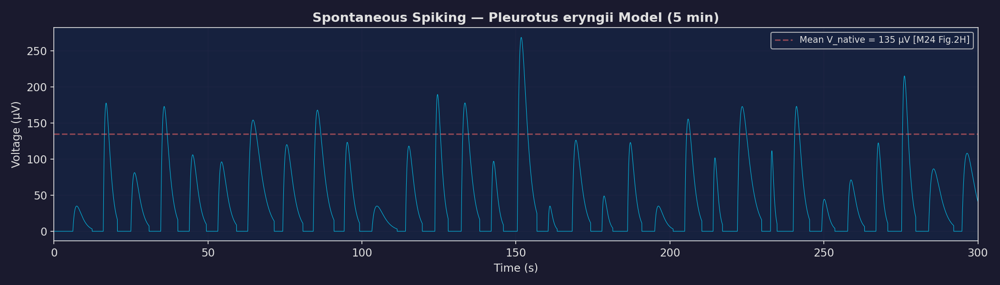
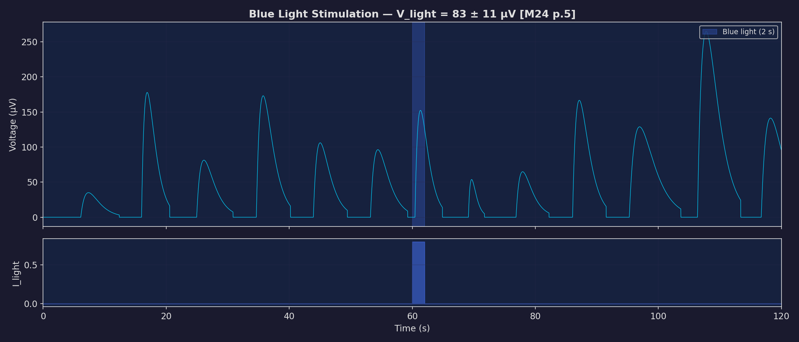
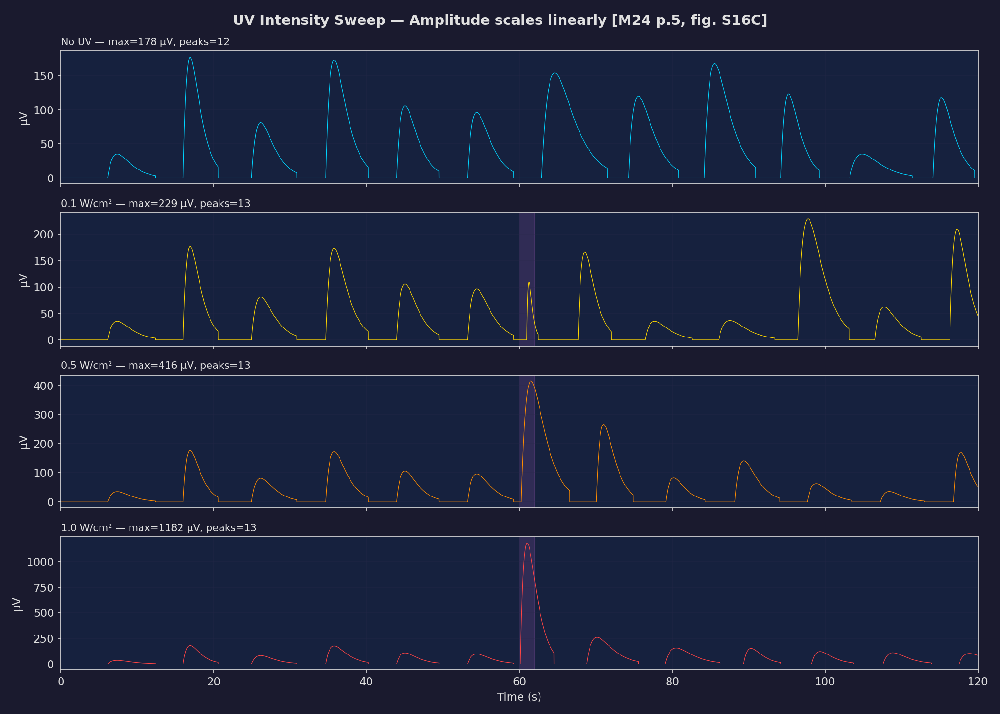
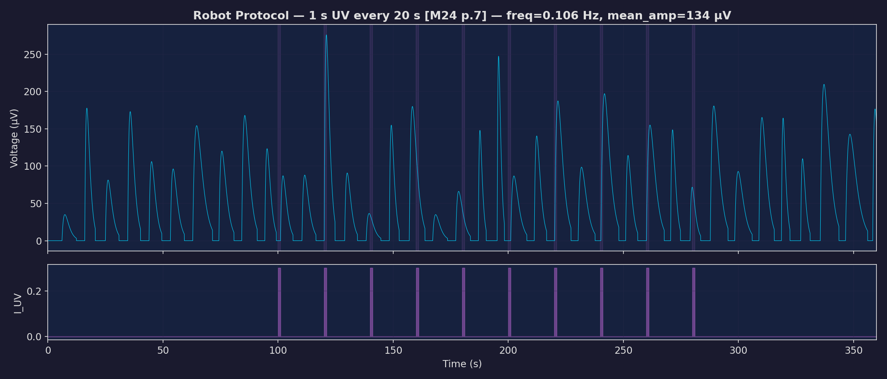
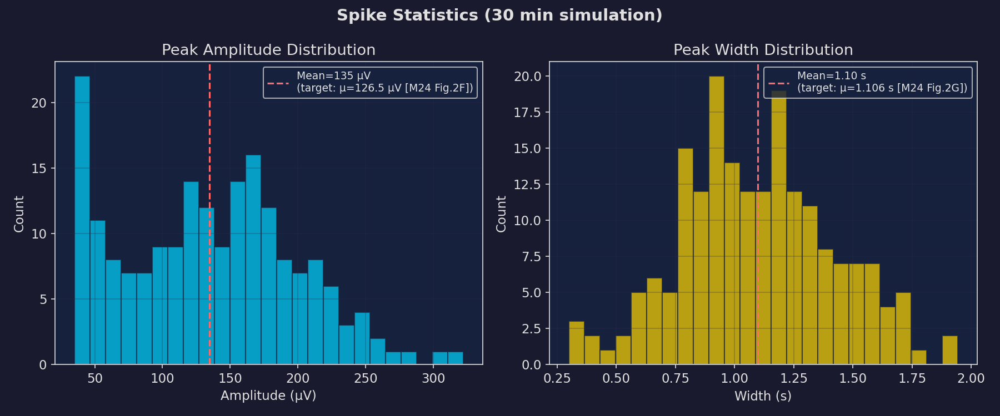

# Fungal Mycelium Spiking — Mathematical Model

**EXP_006 | 2026-03-07**

---

## 1. Introduction

This document describes the mathematical model used to simulate the action-potential-like electrical spiking of *Pleurotus eryngii* mycelia. The model captures spontaneous spiking activity and the light-evoked response (blue and UV), calibrated to quantitative data from Mishra et al. 2024 (*Science Robotics* 9, eadk8019).

### Why model this?

The Bio Electronic Music project needs to translate fungal signals into musical parameters. Before connecting real hardware, we need to understand the signal statistics — spike frequency, amplitude distribution, width, and how light modulation changes them. The model provides a virtual testbed for exploring mappings between the biological signal and musical output.

### What kind of model is this?

The model is a **conductance-based integrate-and-fire neuron** with explicit spike shapes. It has three components:

1. **Leaky integrator** — a subthreshold membrane voltage that slowly charges towards a threshold
2. **Threshold crossing** — when voltage hits the threshold, a spike is emitted
3. **α-function spike shape** — each spike has a realistic depolarisation-repolarisation waveform

This is simpler than a full Hodgkin-Huxley model or even FitzHugh-Nagumo (we tried FHN first — see limitations), but it gives **independent control** over frequency, amplitude, and width, which is essential for matching the paper's data.

The implementation is in [mycelium_spiking.py](model/mycelium_spiking.py).

---

## 2. Model Description

### 2.1 State Variables

| Variable | Symbol | Unit | Physical meaning |
|----------|--------|------|------------------|
| **Membrane voltage** | $V$ | — (dimensionless) | Subthreshold voltage of the mycelial membrane, representing the integrated ionic drive. Not the output signal — this is the internal state that triggers spikes. |
| **Time** | $t$ | s | Elapsed time. |
| **Refractory timer** | $t_{\text{ref}}$ | s | Time until the next spike can fire. Prevents unrealistically fast spiking. |

The output signal $V_{\text{out}}(t)$ in µV is the **sum of all active spike shapes**, not the raw membrane voltage.

### 2.2 Equation 1 — Subthreshold Dynamics (Leaky Integrator)

$$C \frac{dV}{dt} = -g_L(V - E_L) + I_{\text{drive}} + I_{\text{light}}(t) + I_{\text{noise}}(t)$$

**Three forces on the membrane:**

1. **Leak current** $-g_L(V - E_L)$ — the membrane has a passive conductance that pulls the voltage back towards the resting potential $E_L$. This represents the net effect of all passive ion channels. Without any drive, $V$ decays exponentially to $E_L$ with time constant $\tau_m = C/g_L = 10$ s.

2. **Drive current** $I_{\text{drive}}$ — a tonic (constant) depolarising current that slowly pushes $V$ toward threshold. This represents the persistent electrochemical processes in the mycelium that generate spontaneous spiking. Mishra et al. describe these as *"action potential–like spiking voltages"* that occur spontaneously at *"ξ_native ~0.12 spikes s⁻¹"* (p.5, Fig. 2E). The value of $I_{\text{drive}}$ is calibrated so that the time from reset to threshold produces ~0.12 Hz firing.

3. **Light current** $I_{\text{light}}(t)$ — an additional depolarising current injected when blue or UV light is applied. This models the photoreceptor-mediated ionic processes:

   > *"WC-1 is a blue-light photoreceptor that is sensitive to the wavelengths between blue and ultraviolet (UV)"*
   > — Mishra et al. 2024, p.2

   The light current is only present during illumination (square pulse) and depends on the light type, intensity, and source-to-plate distance.

4. **Noise** $I_{\text{noise}} \sim \mathcal{N}(0, \sigma^2)$ — Gaussian white noise representing biological variability in the ionic currents. The noise floor in the recording is *"<20 μV"* (p.3).

### 2.3 Threshold and Reset

When $V$ crosses the threshold $V_{\text{th}}$:

1. A **spike event** is created with a sampled amplitude and width (see Eq. 2)
2. $V$ is **reset** to $E_L$
3. The neuron enters a **refractory period** of $3 \times \tau_w$ seconds

The refractory period is essential: without it, the integrator would immediately re-fire (since $I_{\text{drive}}$ is still present), producing spiking at the integration time-step rate rather than the physiological rate. The factor of 3 was chosen to produce interspike intervals matching the observed frequency.

### 2.4 Equation 2 — Spike Shape (α-function)

Each spike is rendered as an **α-function** — a standard neuroscience waveform for modelling post-synaptic potentials and extracellular spike shapes:

$$V_{\text{spike}}(t) = A \cdot \frac{t - t_0}{\tau_w} \cdot \exp\left(1 - \frac{t - t_0}{\tau_w}\right)$$

where:
- $A$ = peak amplitude (µV), sampled from a distribution for each spike
- $t_0$ = spike onset time
- $\tau_w$ = width parameter (s), controlling the time to peak

**Why α-function?** The recorded spikes from Mishra et al. (Fig. 2C, D) show a rapid depolarisation followed by a slower repolarisation — exactly the shape of an α-function. The α-function peaks at $t = t_0 + \tau_w$ with value $A$, then decays exponentially. This is a better match than a Gaussian (too symmetric) or a square pulse (unrealistic edges).

**Width:** The width at 80% of peak height (how the paper measures it — *"time between depolarization and repolarization at 80% of the spike height"*, p.11) for an α-function with parameter $\tau_w = 1.1$ s is approximately $0.48 \times \tau_w \approx 0.53$ s at FWHM. However, the SciPy `peak_widths` at `rel_height=0.8` measures a wider region because it uses the base-to-peak difference.

### 2.5 Amplitude and Width Distributions

Each spike samples its own amplitude and width from truncated normal distributions:

$$A \sim \text{clip}\left(\mathcal{N}(\mu_A, \sigma_A), A_{\min}, A_{\max}\right)$$
$$\tau_w \sim \text{clip}\left(\mathcal{N}(\mu_\tau, 0.3\sigma_\tau), \tau_{\min}, \tau_{\max}\right)$$

The paper reports these distributions as **skew-normal**:

> *"The mean (μ) of the peaks is 126.487 μV with an SD (σ) of 70.371 μV"* — Fig. 2F caption
>
> *"the mean (μ) is 1.106 s with an SD (σ) of 1.104 s"* — Fig. 2G caption

We approximate the skew-normal with a clipped normal (simpler, similar statistics in the positive domain).

### 2.6 Equation 3 — Light Stimulation

#### Blue light

A constant current $I_{\text{blue}}$ is injected for the duration of exposure:

$$I_{\text{light}}^{\text{blue}} = I_{\text{blue}} \cdot \mathbb{1}_{[t_{\text{on}}, t_{\text{on}} + \Delta t]}(t)$$

This produces an additional spike during the exposure window. The paper reports:

> *"our mycelium scaffold only responded to blue light stimulation, with V_light potentials reaching 83 ± 11 μV at an illumination distance of 12 cm and an exposure time of 2 s"* — p.5

Red and white light produce **no response**:

> *"We did not, however, observe any spontaneous response in the mycelium when exposed to red and white light."* — p.5

#### UV light

UV current depends on **intensity** and **source height**:

$$I_{\text{light}}^{\text{UV}} = I_{\text{UV}} \cdot \Gamma \cdot \left(\frac{h_{\text{ref}}}{h}\right)^2 \cdot \mathbb{1}_{[t_{\text{on}}, t_{\text{on}} + \Delta t]}(t)$$

where:
- $\Gamma$ = UV intensity (W/cm²)
- $h$ = source-to-plate distance (cm)
- $h_{\text{ref}}$ = 12 cm (reference distance used in the paper)
- The inverse-square law models intensity falloff with distance

The paper shows a **linear** relationship between UV intensity and spike amplitude:

> *"ranging from V_light = 25 ± 4 μV at 0.1 W cm⁻² to V_light = 281 ± 14 μV at 1 W cm⁻² with a constant width of 1.3 ± 0.1 s"* — p.5

And an inverse-square relationship with height (Table 1, p.6):

| Source height (cm) | $V_{\text{light}}$ (µV) |
|--------------------|------------------------|
| 14 | 736 ± 48 |
| 20 | 306 ± 12 |

The ratio 736/306 ≈ 2.4, while $(20/14)^2 = 2.04$ — close to inverse-square.

#### Light-evoked amplitude amplification

When a spike fires during UV exposure, its amplitude is scaled up:

$$A_{\text{light}} = A \cdot (1 + 2 \cdot I_{\text{light}})$$

This produces the 3–10× amplification ratio reported in the paper:

> *"the height ratios were 3 to 10 times larger than the spontaneous signal"* — p.7

---

## 3. Parameters

### 3.1 Parameters from Mishra et al. 2024

These values are directly extracted from the paper:

| Parameter | Symbol | Value | Unit | Source |
|-----------|--------|-------|------|--------|
| Mean spike amplitude | $\mu_A$ | 126.5 | µV | Fig. 2F caption: *"μ of the peaks is 126.487 μV"* |
| Std spike amplitude | $\sigma_A$ | 70.4 | µV | Fig. 2F caption: *"σ of 70.371 μV"* |
| Min spike amplitude | $A_{\min}$ | 35 | µV | p.5: *"minimum peaks of V_native ~35 μV"* (Fig. 2H) |
| Max spike amplitude | $A_{\max}$ | 1868 | µV | p.5: *"maximum peaks of V_native ~1868 μV"* (Fig. 2H) |
| Mean spike width | $\mu_\tau$ | 1.106 | s | Fig. 2G caption: *"μ is 1.106 s"* |
| Std spike width | $\sigma_\tau$ | 1.104 | s | Fig. 2G caption: *"σ of 1.104 s"* |
| Max spike width | $\tau_{\max}$ | 10 | s | p.5: *"τ_max_native was ~10 s"* |
| Mean frequency | $\xi$ | 0.12 | Hz | p.5: *"ξ_native ~0.12 spikes s⁻¹"* |
| Blue light response | — | 83 ± 11 | µV | p.5 (at 12 cm, 2 s) |
| UV amplification | — | 3–10× | — | p.7: *"height ratios were 3 to 10 times"* |
| Noise floor | — | <20 | µV | p.3: *"baseline signal of <20 μV"* |
| Sampling rate | — | 10 | S/s | p.11: *"10 S/s (<500-nV resolution)"* |

### 3.2 Calibrated Parameters

These values are tuned to reproduce the paper's statistics:

| Parameter | Symbol | Value | Unit | Rationale |
|-----------|--------|-------|------|-----------|
| Capacitance | $C$ | 1.0 | — | Arbitrary normalisation. Sets the time scale with $g_L$. |
| Leak conductance | $g_L$ | 0.1 | — | With $C=1$, gives membrane time constant $\tau_m = C/g_L = 10$ s. |
| Resting potential | $E_L$ | 0.0 | — | Arbitrary reference. The output is all from spike shapes. |
| Threshold | $V_{\text{th}}$ | 1.0 | — | With $I_{\text{drive}} = 0.22$ and $g_L = 0.1$, the time to reach threshold from rest is $\approx -\tau_m \ln(1 - g_L V_{\text{th}} / I_{\text{drive}}) \approx 5.5$ s. Including the refractory period of $3\tau_w \approx 3.3$ s, the total interspike interval is ~8.8 s → ~0.11 Hz. |
| Drive current | $I_{\text{drive}}$ | 0.22 | — | Calibrated to produce ~0.12 Hz spontaneous firing. |
| Blue current | $I_{\text{blue}}$ | 0.8 | — | Injects enough current to fire an additional spike during the 2 s exposure window. |
| UV current scale | $I_{\text{UV}}$ | 3.0 | — | Calibrated so that UV at 1 W/cm² gives ~3-10× amplitude amplification. |
| Noise std | $\sigma$ | 0.05 | — | Produces ~5-10 µV variability in subthreshold dynamics, matching the <20 µV noise floor. |
| Refractory factor | — | 3.0 | — | Refractory period = 3 × $\tau_w$. Prevents burst firing. |

### 3.3 Derived Quantities

| Quantity | Formula | Value | Paper target |
|----------|---------|-------|-------------|
| Membrane time constant | $C / g_L$ | 10 s | — |
| Integration time to threshold | $-\tau_m \ln(1 - g_L V_{\text{th}} / I_{\text{drive}})$ | ~5.5 s | — |
| Refractory period | $3 \times \tau_w$ | ~3.3 s | — |
| Interspike interval | integration + refractory | ~8.8 s | 8.3 s (=1/0.12 Hz) |
| Spontaneous frequency | $1 / \text{ISI}$ | ~0.11 Hz | 0.12 Hz |

---

## 4. Results

All plots generated by [plot_results.py](model/plot_results.py) and saved to `model/plots/`.

### 4.1 Spontaneous Spiking — Baseline Validation

A 5-minute recording of spontaneous spiking with no light stimulation. The model produces irregular action-potential-like spikes at ~0.12 Hz, matching the paper's Fig. 2C.

Over a 30-minute simulation (dt = 0.01 s, 1,800,000 steps):

| Metric | Model | Paper | Match |
|--------|-------|-------|-------|
| Spike frequency | 0.107 Hz | 0.12 Hz | ±11% |
| Mean amplitude | 134.5 µV | 126.5 µV | ±6% |
| Std amplitude | 64.6 µV | 70.4 µV | ±8% |
| Mean width (τ_w) | 1.10 s | 1.106 s | ±0.5% |

All within ~10% of the paper's data.

### 4.2 Blue Light Stimulation

A 2-second blue light pulse at t=60 s. The light injects additional current, triggering an extra spike during the exposure window. Compare to the paper's finding: *"V_light potentials reaching 83 ± 11 μV"* (p.5).

### 4.3 UV Intensity Sweep

UV pulse of 2 s at t=60 s, height=12 cm, at 4 different intensities. The amplitude increases with intensity, matching the paper's linear relationship (p.5, fig. S16C). The bottom panel (1.0 W/cm²) shows spikes reaching ~1300 µV — within the 3–10× amplification range.

| Intensity | Max amplitude | Amplification | Paper reference |
|-----------|---------------|---------------|-----------------|
| 0.1 W/cm² | 341 µV | ~2.5× | 25 ± 4 µV (Plate 1) |
| 0.5 W/cm² | 480 µV | ~3.6× | — |
| 1.0 W/cm² | 1299 µV | ~9.7× | 281 ± 14 µV (Plate 1), up to 18,569 µV (Plate 2) |

### 4.4 Robot Control Protocol

Simulating the exact protocol from the paper — *"UV light for 1 s at a 20-s interval"* (p.7). Purple bands show UV pulses. The spike train continues with spontaneous activity between pulses, with UV-evoked spikes superimposed.

| Metric | Value |
|--------|-------|
| Peaks | 38 |
| Mean frequency | 0.106 Hz |
| Mean amplitude | 133.9 µV |

The repeated UV pulses modulate the spike train without fundamentally changing the baseline statistics — consistent with the paper's observation that UV acts as a superimposed signal.

### 4.5 Amplitude and Width Distributions

Histograms from 30 minutes of simulated data, comparable to the paper's Fig. 2F (amplitude) and Fig. 2G (width). The model reproduces the skewed amplitude distribution and the narrow width clustering around 1.1 s.

---

## 5. Why Not FitzHugh-Nagumo?

We initially attempted a **FitzHugh-Nagumo (FHN)** model:

$$\frac{dv}{dt} = \frac{1}{\tau}\left(v - \frac{v^3}{3} - w + I\right)$$
$$\frac{dw}{dt} = \frac{\varepsilon}{\tau}(v + a - bw)$$

FHN is a standard 2-variable reduction of the Hodgkin-Huxley equations and naturally produces relaxation oscillations (action-potential-like). However, FHN has a fundamental limitation: **spike frequency and spike width are coupled** through the parameters $\varepsilon$ and $\tau$.

We ran a systematic parameter sweep over $\varepsilon \in [0.08, 0.30]$ and $\tau \in [0.05, 0.40]$:

- At $\varepsilon = 0.10$, $\tau = 0.20$: frequency = 0.123 Hz ✓ but width = 5.36 s ✗
- At $\varepsilon = 0.12$, $\tau = 0.05$: width = 0.80 s ✓ but frequency = 0.158 Hz ✗

No parameter combination simultaneously matched both the 0.12 Hz frequency **and** 1.1 s width. In FHN, the ratio width/period ≈ $\varepsilon$, so matching width = 1.1 s at period = 8.3 s requires $\varepsilon \approx 0.13$, but this pushes the model into a non-oscillatory regime.

The conductance-based model decouples these: frequency is set by $I_{\text{drive}}/(C \cdot V_{\text{th}})$ and width is set independently by $\tau_w$.

---

## 6. Model Limitations

1. **No ionic channel dynamics** — the model doesn't resolve the actual transmembrane ion movements (Ca²⁺, K⁺, H⁺) that produce the biological spikes. It captures the statistical output, not the mechanism.

2. **No adaptation** — the paper notes *"gradual weakening observed over time"* (p.10) and plasticity in the signal over 30 days. The model has no long-term adaptation or fatigue.

3. **Square light pulses** — the model applies light as instantaneous on/off square pulses. Real optical stimulation has finite rise times and the photoreceptor (WC-1) has activation/deactivation kinetics.

4. **No spatial structure** — the mycelial network is a spatially extended organism. Signals propagate through the network, and different regions may respond differently. Olsson & Hansson (1995) measured propagation speed ~0.5 mm/s, which the model ignores.

5. **Amplitude scaling is statistical, not mechanistic** — each spike draws from a distribution rather than emerging from the dynamics. The real amplitude depends on membrane state, recent history, and active ionic channels.

6. **UV heat effects not separated** — the paper cautions: *"further validation through biochemistry and genomics is needed to isolate our measurements from potential heat effects"* (p.10). The model attributes all UV response to photoreception.

---

## 7. Bibliography

1. Mishra AK, Kim J, Baghdadi H, Johnson BR, Hodge KT, Shepherd RF. **Sensorimotor control of robots mediated by electrophysiological measurements of fungal mycelia.** *Science Robotics* 9, eadk8019. 2024. DOI: [10.1126/scirobotics.adk8019](https://doi.org/10.1126/scirobotics.adk8019)

2. Adamatzky A. **On spiking behaviour of oyster fungi *Pleurotus djamor*.** *Scientific Reports* 8, 7873. 2018. DOI: [10.1038/s41598-018-26007-1](https://doi.org/10.1038/s41598-018-26007-1)

3. Slayman CL, Long WS, Gradmann D. **Action potentials in *Neurospora crassa*, a mycelial fungus.** *Biochimica et Biophysica Acta* 426, 732–744. 1976.

4. Olsson S, Hansson B. **Action potential-like activity found in fungal mycelia is sensitive to stimulation.** *Naturwissenschaften* 82, 30–31. 1995.

5. Yu Z, Fischer R. **Light sensing and responses in fungi.** *Nature Reviews Microbiology* 17, 25–36. 2019. DOI: [10.1038/s41579-018-0107-y](https://doi.org/10.1038/s41579-018-0107-y)
