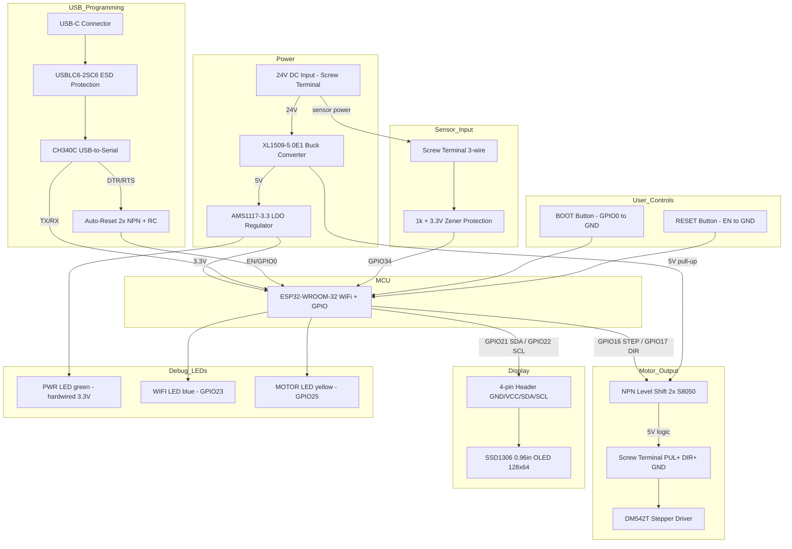

# ESP32 Motor Controller — Tiered Designs

## Functional Block Diagram

---

## Design Tier

This is a single-purpose motor controller board. Unlike multi-channel designs (e.g., EXP_008's 8ch/4ch/2ch tiers), there's only one meaningful configuration:

### Tier 1 (Only Tier): 1× DM542T Motor Controller

| Functional Block | Components | Count |
|-----------------|------------|-------|
| MCU + WiFi | ESP32-WROOM-32 | 1 |
| Power regulation | XL1509-5.0E1 + AMS1117-3.3 | 2 ICs |
| USB programming | CH340C + USB-C + ESD + auto-reset (2× NPN) | 5 parts |
| Motor level shift | 2× S8050 NPN + 4× resistors | 6 parts |
| Sensor input | Pull-up + Zener + series resistor | 3 parts |
| Display | 4-pin header (OLED off-board) | 1 part |
| Debug LEDs | 3× LED + 3× current-limit resistor | 6 parts |
| User controls | 2× tactile buttons | 2 parts |
| Passive support | Caps, resistors, inductor, diode | ~15 parts |
| **Total unique components** | | **~25 types** |
| **Total placed parts** | | **~45 parts** |

> **No additional tiers needed.** Adding a second motor channel would require 2 more NPN transistors + 2 more GPIO pins + wider screw terminals — but the user specified 1× DM542T only.

---

## Board Specifications

| Parameter | Value |
|-----------|-------|
| Layers | 2 |
| Estimated size | ~60mm × 45mm |
| Power input | 24V DC via screw terminal |
| Max current draw (3.3V rail) | ~360 mA |
| Max current draw (24V input) | ~90 mA |
| JLCPCB assembly | SMT + through-hole mixed |
| Estimated cost (5 boards + assembly) | ~$15–25 |
