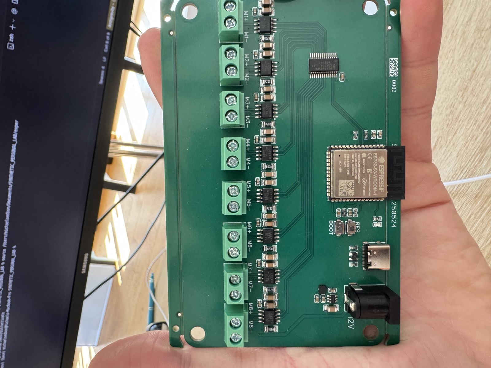
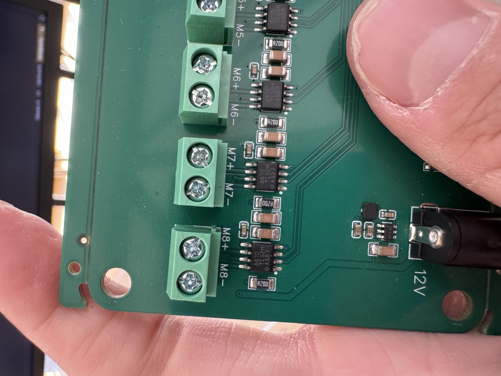
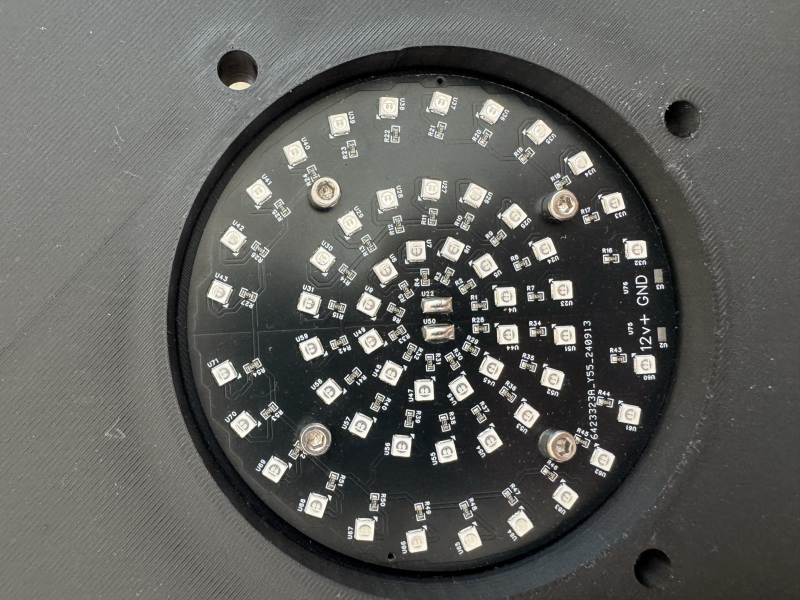

# Hardware Inventory

> Last updated: 2026-03-12

## Devices

| ID | Device | MCU / Type | Connection | Address | Firmware | API |
|----|--------|-----------|------------|---------|----------|-----|
| LED_DRV8 | 8-Channel LED Driver | ESP32-S3-WROOM-1 | WiFi (STA) | `172.16.1.126` / `leddriver.local` | [led_drv8](firmware/led_drv8.md) | [led_drv8_api](api/led_drv8.md) |
| LED_RING | Circular LED Array (~70 LEDs) | Passive (no MCU) | Wired to LED-DRV8 M1–M8 | — | — | — |
| ADC_24 | PicoScope ADC-24 | 24-bit USB ADC | USB HID | — | PicoSDK | Python `picosdk` |
| SENSOR_STIM | Mycelium Sensor/Stim Board | ESP32-S3 + ADS1299 | USB-C | — | — (in design) | — |

### Photos

## LED-DRV8 — Component Details

| Component | Part | Specs |
|-----------|------|-------|
| **MCU** | ESP32-S3-WROOM-1 | Dual-core 240 MHz, WiFi/BLE, USB-C |
| **PWM Driver** | NXP PCA9685PW | 16-ch, 12-bit I²C PWM, address 0x40 |
| **Output Drivers** | 8× TI DRV8870DDAR | H-bridge, 6.5–45V, 3.6A peak |
| **Outputs** | 8× screw terminal pairs | M1–M8 |
| **Power** | 12V barrel jack + USB-C | |
| **I²C Pins** | SDA = GPIO6, SCL = GPIO1 | |
| **PWM Frequency** | 1 kHz | |

### PWM Channel Mapping

| Output | PCA9685 LED Channels | DRV8870 |
|--------|---------------------|---------|
| M1 | LED0 (IN1), LED1 (IN2) | Driver 1 |
| M2 | LED2 (IN1), LED3 (IN2) | Driver 2 |
| M3 | LED4, LED5 | Driver 3 |
| M4 | LED6, LED7 | Driver 4 |
| M5 | LED8, LED9 | Driver 5 |
| M6 | LED10, LED11 | Driver 6 |
| M7 | LED12, LED13 | Driver 7 |
| M8 | LED14, LED15 | Driver 8 |

> For LED driving: IN1 = PWM (forward current), IN2 = 0 (ground path)

## Mycelium Sensor/Stim Board — Design Summary (EXP_008)

| Block | Function | Key IC |
|-------|----------|--------|
| Recording | 8-ch extracellular action potential | TI ADS1299IPAG (24-bit, <1 µVpp noise) |
| Stimulation | 4-ch programmable current pulse | Improved Howland current pump (0–200 µA) |
| MCU | Control + USB data streaming | ESP32-S3 |
| Power | Clean analog + digital rails | Dual LDO 3.3V + bipolar ±5V |
| Electrode interface | 8 recording + 4 stim + GND | Pin headers + ESD diodes |

> **Status:** Design phase. See [RESEARCH_REPORT.md](../../experiments/EXP_008/pcb/RESEARCH_REPORT.md) and [TIERED_DESIGNS.md](../../experiments/EXP_008/pcb/TIERED_DESIGNS.md).

## Datasheets & Product Links

| Component | Link |
|-----------|------|
| ESP32-S3-WROOM-1 | [Espressif Datasheet](https://www.espressif.com/sites/default/files/documentation/esp32-s3-wroom-1_wroom-1u_datasheet_en.pdf) |
| PCA9685PW | [NXP PCA9685](https://www.nxp.com/docs/en/data-sheet/PCA9685.pdf) |
| DRV8870DDAR | [TI DRV8870](https://www.ti.com/lit/ds/symlink/drv8870.pdf) |
| ADS1299IPAG | [TI ADS1299](https://www.ti.com/lit/ds/symlink/ads1299.pdf) |
| PicoScope ADC-24 | [Pico Technology](https://www.picotech.com/data-logger/adc-20-adc-24/precision-data-acquisition) |
